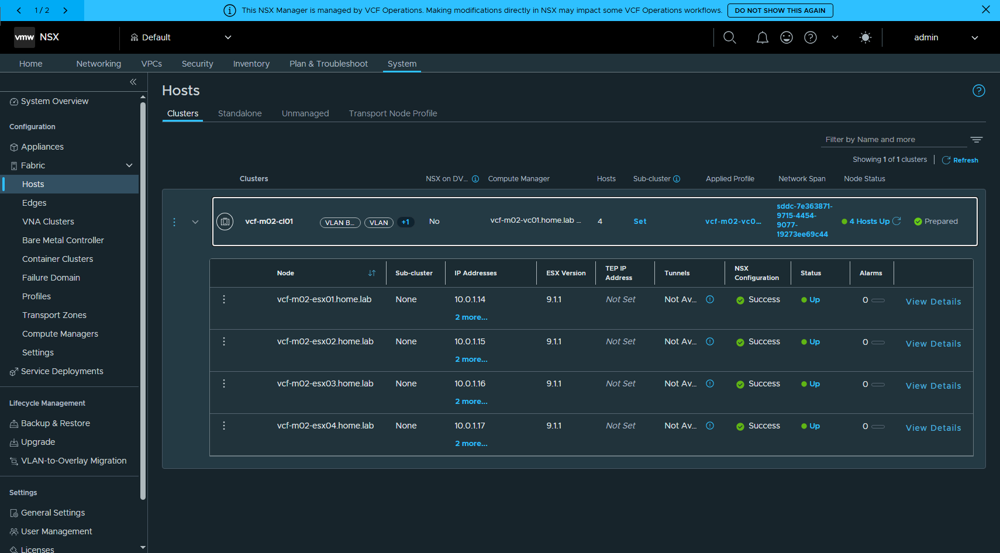
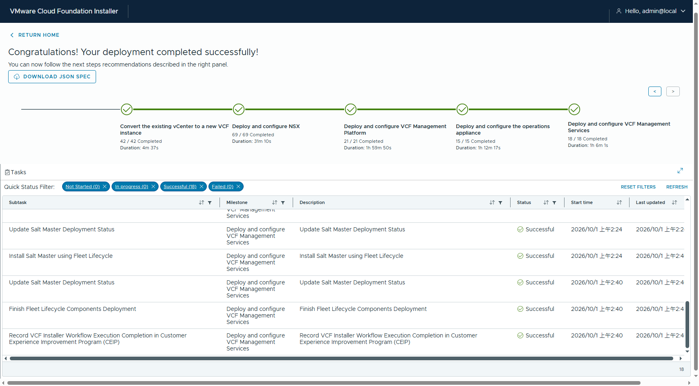

# Converge 到 VCF 9.1.1 —— 完全不部署 Overlay

把一套「已建置到 9.1.1、尚未被任何 SDDC Manager 納管」的 vSphere,用 VCF Installer 9.1.1 converge 成 VCF Management Domain,**刻意不部署 overlay**。

實作日期:2026-09-30 ~ 10-01
結果:**`COMPLETED_WITH_SUCCESS` — 181/181 子任務,0 失敗,5 小時 26 分**

📄 完整手冊(23 頁 / 15 張截圖):[`VCF911-Converge-NoOverlay.docx`](VCF911-Converge-NoOverlay.docx)

---

## TL;DR

| 問題 | 答案 | 依據 |
|---|:--:|---|
| 可以 converge 成 VCF 但完全不設 overlay? | ✅ | 變體 A 實測成功,4 台 host 全程 vtepless |
| 可以 converge 成完全沒有 NSX? | ✅ | `workflowType=VVF`,installer 以 `VALIDATION_VVF` 驗證 |
| 不給 TEP 會擋住 NSX 部署或 host prep? | ❌ 不會 | NSX 69/69、cluster `Prepared`、4 Hosts Up |

**關鍵欄位:**

```jsonc
"nsxtSpec": {
    "useExistingDeployment": false,
    "nsxtManagers": [ { "hostname": "vcf-m02-nsx01a.home.lab" } ],
    "vipFqdn": "vcf-m02-nsx01.home.lab",
    "skipNsxOverlayOverManagementNetwork": true
    // 🔴 刻意不給 transportVlanId / ipAddressPoolSpec
}
```

### 三種寫法的差別(只在 `nsxtSpec`)

| 變體 | 做法 | 狀態 |
|---|---|---|
| **A** | `workflowType=VCF`;部 NSX,`skipNsxOverlayOverManagementNetwork=true` 且不給 TEP | 本文完整實作 ✅ |
| **B** | `workflowType=VVF`;整個省略 `nsxtSpec` 與 `sddcManagerSpec` | 驗證到只差 bundle,路線確認可行 |
| (對照) | `skipNsxOverlayOverManagementNetwork=false` → overlay 走 vmk0,不需 TEP 網段 | 見 [`../README.md`](../README.md) |

---

## 「沒有 overlay」的證據鏈

converge **完成後**再驗一次:

```
# GET /api/v1/transport-nodes -> host_switch_spec.host_switches[].ip_assignment_spec
vcf-m02-esx01.home.lab     ip_assignment_spec=None
vcf-m02-esx02.home.lab     ip_assignment_spec=None
vcf-m02-esx03.home.lab     ip_assignment_spec=None
vcf-m02-esx04.home.lab     ip_assignment_spec=None
```

NSX UI(System → Fabric → Hosts → 展開 cluster):

| Node | IP | ESX | **TEP IP Address** | Tunnels | NSX Configuration | Status |
|---|---|---|---|---|---|---|
| vcf-m02-esx01 | 10.0.1.14 | 9.1.1 | **Not Set** | Not Available | ✅ Success | ● Up |
| vcf-m02-esx02 | 10.0.1.15 | 9.1.1 | **Not Set** | Not Available | ✅ Success | ● Up |
| vcf-m02-esx03 | 10.0.1.16 | 9.1.1 | **Not Set** | Not Available | ✅ Success | ● Up |
| vcf-m02-esx04 | 10.0.1.17 | 9.1.1 | **Not Set** | Not Available | ✅ Success | ● Up |



> ⚠ 精確的說法是「**掛在 overlay TZ 上但 vtepless**」,不是「沒有 overlay transport zone」。
> `nsx-overlay-transportzone` 存在、4 個 transport node 也掛在上面、Status 是 Up —— 只是沒有 TEP 就沒有 tunnel,overlay 流量實際上跑不起來。

---

## 五個里程碑

| 里程碑 | 子任務 | 耗時 |
|---|---:|---|
| Convert the existing vCenter to a new VCF instance | 42 / 42 | 4m 37s |
| Deploy and configure NSX | 69 / 69 | 31m 10s |
| Deploy and configure VCF Management Platform (VSP) | 21 / 21 | 1h 59m 50s |
| Deploy and configure the operations appliance | 15 / 15 | 1h 12m 17s |
| Deploy and configure VCF Management Services | 18 / 18 | 1h 6m 1s |



---

## 目標端怎麼建

NSX **不需要**事先安裝 —— converge 會自己部。目標端只要 vCenter + ESXi + vSAN + VDS。

1. **4 台 nested ESXi**(9.1.0 OVA)+ 6 個 vSAN advanced settings
2. **vCenter 9.1.1** —— 用 ISO 的 `vCSA_with_cluster_on_ESXi.json` 在 esx01 上以單節點 vSAN 引導
3. **加主機 / 建 VDS / 收 vSAN / 開 DRS+HA** —— [`scripts/Build-ConvergeTarget.ps1`](scripts/Build-ConvergeTarget.ps1)
4. **vLCM 升到 9.1.1**(ESXi 9.x 的 esxcli 已不收遠端 bundle URL)
5. 確認 vCenter 上**沒有** `com.vmware.sddcManager` / `com.vmware.vcf.client` extension

### 🔴 兩個前置硬性條件

```bash
# (1) installer 必須乾淨 —— 做過 bring-up/converge 的 installer 記著舊 domain
curl -sk -H "Authorization: Bearer $T" https://<installer>/v1/sddcs    # 必須是 []

# (2) 目標端不可有 VCF extension
govc extension.info | grep -iE "sddcmanager|vcf.client"                # 應該沒有輸出
```

---

## 踩坑速查

| # | 現象 | 根因 / 解法 |
|:--:|---|---|
| 1 | cluster 裡 host 名稱是 IP 不是 FQDN | `vcsa-deploy` 範本的 `esxi.hostname` 填了 IP → 改填 FQDN;已發生就 `govc object.rename` |
| 2 | VDS cmdlet 全噴 `Field not found: VIObjectImpl._connectionId` | PowerCLI 13.3 與 13.5 混裝 → `Import-Module -RequiredVersion 13.5.0.25380678`(Sdk/Core/Vds/Storage 都要) |
| 3 | 把 VM 搬到 VDS portgroup 後 **vCenter 失聯** | 那台主機在 VDS 上沒有 uplink → 直連 ESXi 救:`govc vm.network.change -vm <vm> -net "VM Network" ethernet-0` |
| 4 | vLCM apply 回 `SUCCEEDED` 但**主機沒升級** | 看 `last-apply-result` 的 `skipped_hosts`;根因是 host DNS 把 `10.0.0.1` 排前面,解不到 vCenter FQDN(ESXi resolver 不 fallback) |
| 5 | vLCM remediate `FAILED: Health Check failed` | 先用 `VsanQueryVcClusterHealthSummary` 查出非綠項目,再用**短 id** 靜音 |
| 6 | 靜音 API 整批回 500 | 清單裡有無效 id(`Invalid silent health check id`);而且吃的是短 id `nvmeonhcl`,不是 `com.vmware.vsan.health.test.nvmeonhcl` |
| 7 | 舊 vsan-silence 腳本在 PowerShell 7 跑不動 | `ICertificatePolicy` 在 .NET Core 不存在 → `-SkipCertificateCheck`;錯誤讀 `$_.ErrorDetails.Message` |
| 8 | `Add-VsanDisk` 不存在 | 用 `New-VsanDisk -VsanDiskGroup <dg> -CanonicalName <disk>`(注意不是 `-DataDiskCanonicalName`) |
| 9 | `pre_remediation_power_action` 設了變 `_UNKNOWN` | SDDC Manager 訊息是截斷的;正確 enum 是 **`DO_NOT_CHANGE_VMS_POWER_STATE`** |
| 10 | `PATCH /v1/bundles/{id}` 回 400 | payload 要 `{"bundleDownloadSpec":{"downloadNow":true}}`,不是 `{"operation":"DOWNLOAD"}` |
| 11 | validation 報 `IP family mismatch` | `vspClusterSpec.instanceFqdn` 的名稱**沒有 DNS 記錄** |
| 12 | 監看腳本一直顯示 `0/N` | subtask 成功狀態是 **`POSTVALIDATION_COMPLETED_WITH_SUCCESS`** |
| 13 | `Prepare-NestedESXi.ps1` 卡住且無輸出 | 沒給 `-Password` 會跳 `Get-Credential`,非互動環境無聲卡死 |
| 14 | ESXi 9.x `esxcli software profile update -d <http url>` 失敗 | `Only server local file path is supported for offline bundles` → 改走 vLCM 匯入 depot |

---

## 檔案

```
converge/no-overlay/
├── VCF911-Converge-NoOverlay.docx    # 23 頁完整手冊(15 張截圖)
├── shots/                            # 逐步截圖
├── cli/                              # CLI / API 原始輸出(證據)
│   ├── nsx-vtepless.txt              #   🔑 「沒有 overlay」證據鏈
│   ├── nsx-transport-nodes*.json
│   ├── sddcm-inventory.txt           #   SDDC Manager 納管結果
│   ├── converge-milestones.txt
│   ├── validation-a-final.txt        #   變體 A 最終驗證
│   └── validation-b-vvf.txt          #   變體 B(VVF)驗證
├── specs/
│   ├── converge-m02-A-nsx-no-overlay.json
│   ├── converge-m02-B-vvf-no-nsx.json
│   └── vcsa-install-m02.json
└── scripts/
    ├── Build-ConvergeTarget.ps1      # 加主機 + VDS + vmk + vSAN + DRS/HA
    ├── Add-VsanCapacity.ps1          # 往既有 disk group 加 capacity disk
    ├── Get-VsanHealth.ps1            # 列出非綠的 vSAN health 檢查
    ├── Silence-VsanChecks.ps1        # 靜音(擋 vLCM remediate 的元兇)
    └── gen-converge-nooverlay-doc.js # docx 產生器
```

> 所有 spec 與腳本的帳密都是 `<PLACEHOLDER>` 或環境變數,repo 內不含任何明文密碼。
