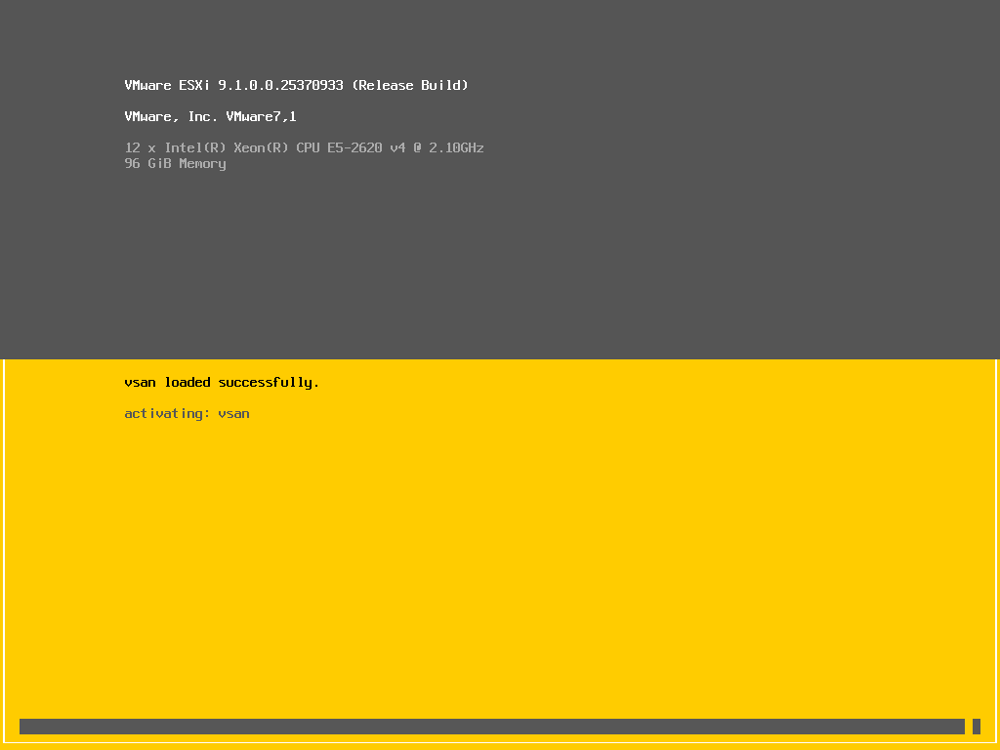
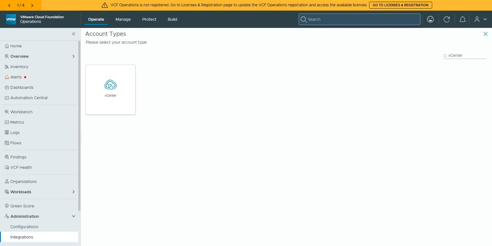
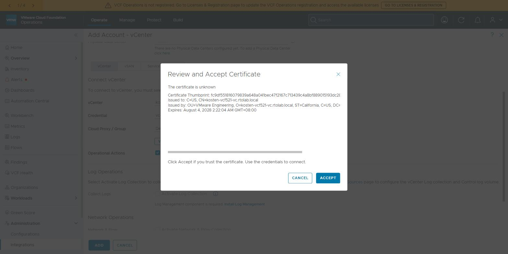
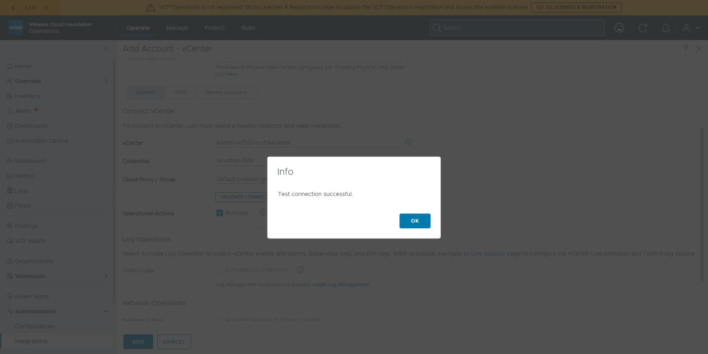
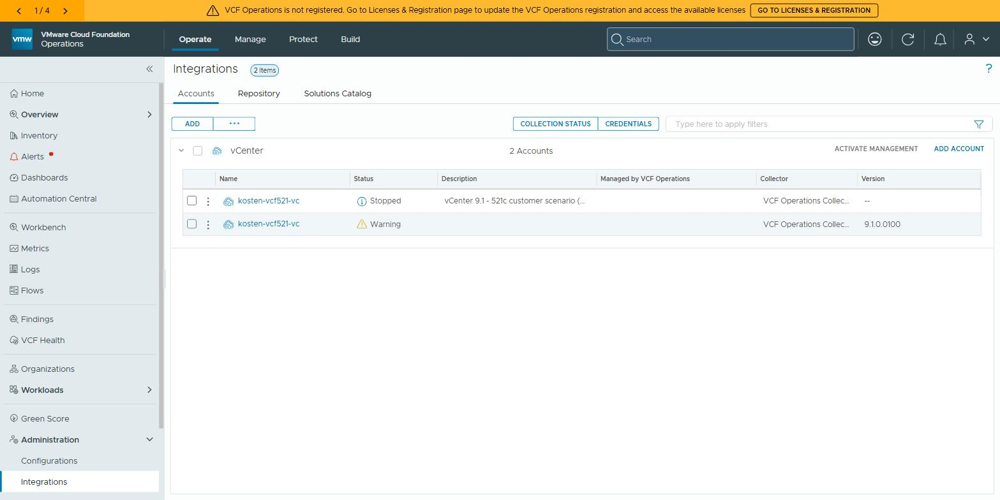
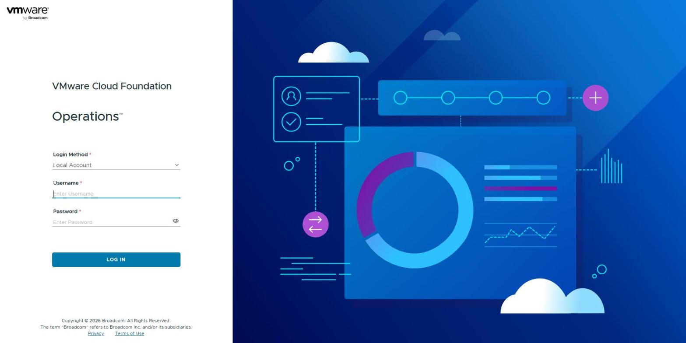
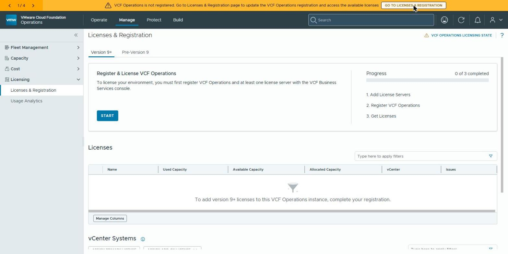
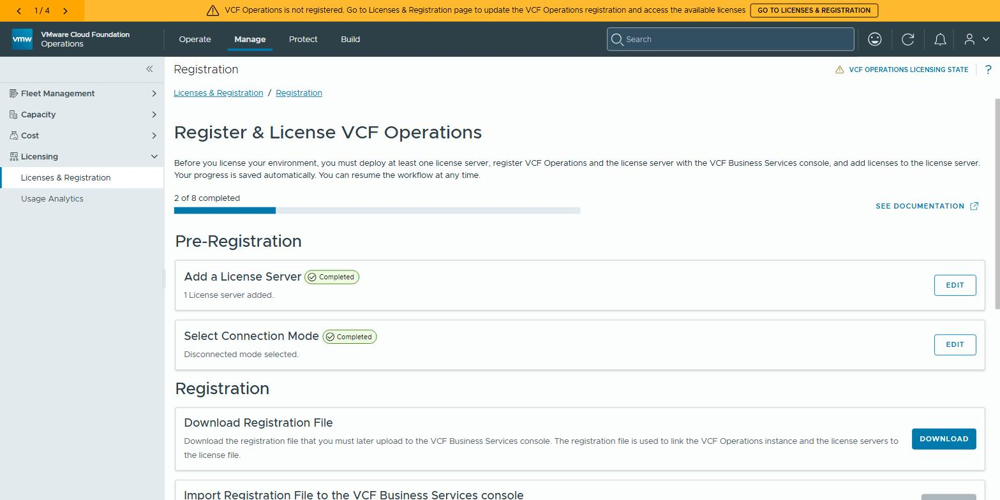
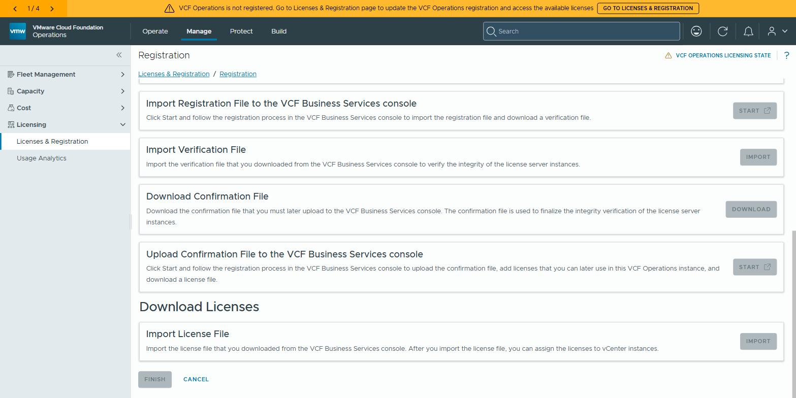
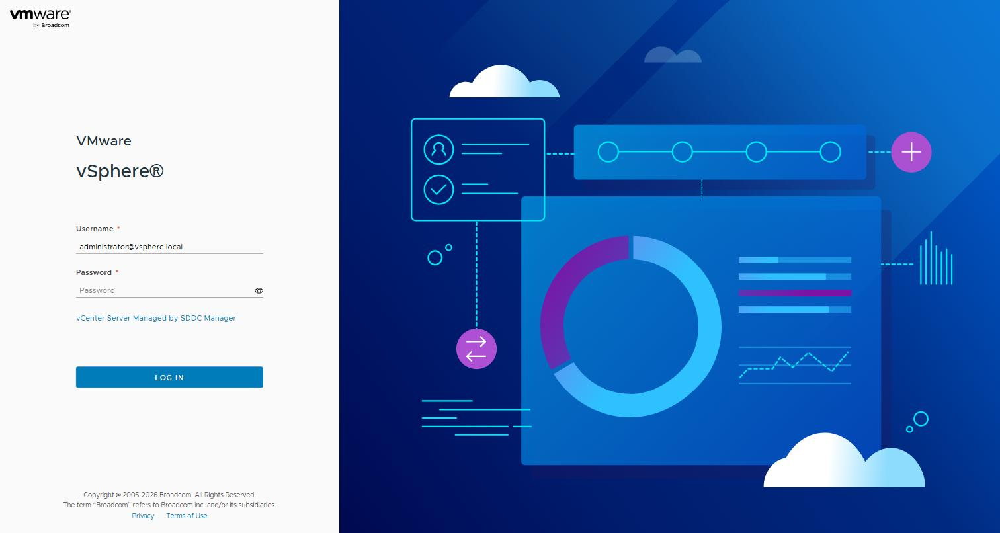

# 客戶情境：**沒有 SDDC Manager 的 vSphere**，用 RDU 把 vCenter 8.0U3 → 9.1

> 第二輪實測（2026-08-19，rtolab `521c` 這套 nested VCF 5.2.1）。
> 與 [README](README.md) 第一輪的差別：**第一輪是「先升 NSX 再升 vCenter」的完整 VCF 路線**；
> 這輪模擬**客戶的 vSphere/VVF 環境** —— 客戶**沒有 SDDC Manager、沒有 NSX**，要求升到 9.1 後能被 **VCF Operations + License Server** 認證授權。
> 所以這輪是：**先把環境「客戶化」（移除 NSX / SDDC Manager）→ 用 RDU 升 vCenter → ESXi 手升 → 接授權**。
>
> ⚠️ Lab / 研究用途。移除 SDDC Manager 沒有官方流程；本文所有密碼皆不記錄。

---

## 🏆 這輪最大的發現：**RDU 的 switchover 被 NSX 版本硬擋，而且看不出來**

### 症狀
`vcsa-deploy upgrade`（9.1 installer 預設就是 **RDU / Reduced Downtime Upgrade**）跑到一半就不動了，**外觀完全不像出錯**：

```
Status of subtask precheck            is SUCCEEDED
Status of subtask preparation         is RUNNING     ← 停在 66%
Progress message ... 'Unknown message ID vcenter.deployment.migration_upgrade.schedule_wait.schedule_ready.progress_message requested'
Status of subtask switchover          is BLOCKED
Status of subtask post_upgrade_tasks  is PENDING
```

狀態 API（**注意：要用 Basic auth，帶 `vmware-api-session-id` 會 401**）：

```bash
curl -sk -u 'administrator@vsphere.local:<PASSWORD>' \
  https://<source-vc-fqdn>/lcm/rest/vcenter/lcm/deployment/migration-upgrade/status
```
```json
{ "current_state": "SWITCHOVER", "desired_state": "UPGRADED",
  "status": "BLOCKED", "progress": { "completed": 41 },
  "subtasks": { "preparation": {"status":"RUNNING","progress":{"completed":66}},
                "switchover":  {"status":"BLOCKED","progress":{"completed":0}} } }
```

### 真因：只有來源 vCenter 的 `vlcm.log` 看得到
```
/var/log/vmware/vlcm/vlcm.log   （每 60 秒重複一次）

[internal/version.go:20] Find all NSX that are not supported with the given vCenter: NSX < 9.1.0
[internal/extensions.go:27] Getting NSX version registered with the given vCenter: ...
[internal/version.go:30] WARNING Found NSX (com.vmware.nsx.management.nsxt) on unsupported version (4.2.1.0)
```
同一份 log 同時顯示**資料早就複製完了**：
```
[dbreplication/monitoring.go:248] Remaining data to be replicated is 0, state:streaming
[filereplication/replicator.go:254] Remaining file data: 0
```

→ **precheck 只把「NSX 不相容」列成 WARNING，實際上它是 switchover 的硬性 gate**：
```
Warning: Unsupported NSX at version 4.2.1.0 registered with the vCenter to be upgraded
         (Extension Key com.vmware.nsx.management.nsxt)
Resolution: Upgrade the NSX to a version compatible with the new vCenter version
            before starting the upgrade's switchover phase.
```
LCM 判斷依據是 **vCenter 上的 extension 註冊**（`com.vmware.nsx.management.nsxt`），不是 NSX 本身可不可達。

### 解除後的行為（實測）
移除 NSX 與 vCenter 的註冊後，**下一輪檢查（60 秒內）就放行**：
```
14:57:06Z [adapter/nsx.go:68] NSX upgrade complete
14:57:10Z Controller.Process(op:execute ... label:StopServicesBeforeSwitchover)
14:57:10Z [service/service.go:215] Stop services [analytics(vmon,running,auto) applmgmt(...)]
```

### 給客戶的結論
> **要升 vCenter 到 9.x（RDU 路線）之前，NSX 必須先升到 ≥ 9.1，或是把 NSX 從該 vCenter 的註冊移除。**
> 否則 RDU 會停在一個「看起來還在跑、實際永遠不會前進」的狀態：progress 卡 41%、CLI 只印 `Unknown message ID`、precheck 全綠。

### 排除過的死路（別再試一次）
| 嘗試 | 結果 |
|---|---|
| `POST …/migration-upgrade?action=apply` 帶 `{"start_switchover":"<ISO8601Z>"}` | **HTTP 204 但不解鎖**（塞 `{"pause":"__PROBE__"}` 這種垃圾值也回 204 → body 根本沒被驗證） |
| `?action=switchover` / `?action=resume` / `?action=proceed` | 404 |
| `…/migration-upgrade/switchover`、`/schedule`、`/answers`、`/questions`、`/blockers` | 404 |
| `vcsa-deploy` 有無 switchover 子指令 | 沒有，只有 `{install,upgrade}` |
| PowerCLI 9.1 SDK `Invoke-VcenterLcmDeploymentMigrationUpgradeApply` / `Initialize-…ApplySpec -StartSwitchover -Pause` | cmdlet 存在，但 `VMware.Sdk.vSphere` 13.5 與同機舊版 8.0.2099 SDK 模組衝突載不進來 |
| **有效的入口** | `GET …/migration-upgrade`（spec，密碼欄顯示 CENSORED）與 `GET …/migration-upgrade/status`，**Basic auth** |

### 另外兩個 RDU 行為
- **`--precheck-only` 不是唯讀**：它會先把**來源 vCenter 的 vLCM 服務就地升級**（log: `Running Upgrade VLCM service: Upgrading the VLCM service before performing Reduced Downtime Upgrade` → `VLCM is updated successfully`）。跑 precheck 就已經動到來源。
- **RDU 會忽略 `vcdb_migrateSet`**：`WARNING: The migrate set option will be ignored as the selected upgrade framework is Reduced Downtime Upgrade.` → 模板裡填 `core` 無效。
- CLI 等太久會自己逾時退出並印 `Upgrade of VC has failed`，但同時說 `however the upgrade is still running`（KB 311902）—— **升級是 appliance 端在跑，CLI 只是觀察者**，不要因為 CLI 退出就以為失敗。

---

## 把環境「客戶化」：正常移除 NSX（比想像多兩步）

環境：NSX 4.2.1，1 個 compute manager、1 個 transport node collection、4 台 host transport node、1 個 transport node profile，**0 edge cluster、0 segment**（管理 appliance 都在 VDS VLAN portgroup 上，拆 NSX 不影響管理面）。

```bash
NSX=https://<nsx-vip>
AUTH='admin:<PASSWORD>'

# 1) 解除 cluster 與 TNP 的綁定（⚠️ 這一步不會移除 NSX，host transport node 仍在）
curl -sk -u $AUTH -X DELETE $NSX/api/v1/transport-node-collections/<tnc-id>

# 2) ★ 真正的「Remove NSX」= 逐台刪 transport node，帶 unprepare_host=true
curl -sk -u $AUTH -X DELETE "$NSX/api/v1/transport-nodes/<tn-id>?unprepare_host=true"
#    4 台實測約 1 分鐘全部解除

# 3) 刪 compute manager → 會被擋
#    HTTP 400 error_code 9547:
#    "Cannot delete in use compute manager ... Please remove VDS hostswitches
#     from corresponding Transport Node Profile(s)"
curl -sk -u $AUTH -X DELETE $NSX/api/v1/fabric/compute-managers/<cm-id>

# 4) 先刪 transport node profile
curl -sk -u $AUTH -X DELETE $NSX/api/v1/transport-node-profiles/<tnp-id>

# 5) 再刪 compute manager → 仍可能 400，但訊息換成
#    "... from corresponding TransportNodes {vcf-m02-vds01=InUseTransportNodeCount 2}"
#    此時 /transport-nodes 與 policy 端 host-transport-nodes 都已經是 0
#    → NSX switching inventory 有延遲，計數會自己往下掉（實測 2 → 1 → 0），重試即可
#    （約 3 分鐘後 HTTP 200；?force=true 不存在，回 error_code 268 unknown parameter）
```

移除 compute manager 後，vCenter 上的 `com.vmware.nsx.management.nsxt` extension 會自動消失（實測約 1 分鐘內）。**不需要**、也不該直接去 vCenter 的 ExtensionManager 手動挖掉。

驗證：
```powershell
(Get-View ExtensionManager).ExtensionList.Key | Where-Object { $_ -match 'nsx' }   # 應為空
```

---

## 把環境「客戶化」：移除 SDDC Manager

⚠️ **VCF 沒有官方的 decommission SDDC Manager 流程**，以下是模擬客戶（vSphere/VVF）環境的 lab 做法：

1. **先關機** SDDC Manager appliance（先關再拆，避免它把 extension 重新註冊回去）
2. 從 vCenter 移除 VCF 相關 extension：
   ```powershell
   $em = Get-View ExtensionManager
   'com.vmware.sddcManager','com.vmware.vcf.client','com.vmware.lcm.client' |
     ForEach-Object { $em.UnregisterExtension($_) }
   ```
3. ⚠️ **`com.vmware.vlcm.client` 不要刪** —— 那是 vCenter 自己的 vLCM UI，不是 VCF 的。

做在 switchover **之前**，改動會隨 RDU 複製一起帶進新的 9.1 vCenter，切換後直接就是乾淨的客戶樣貌。

---

## 順手清掉 Supervisor / spherelet（如果客戶啟用過 Workload Management）

vCenter 9 沒有 baseline，cluster 一定要轉成 vLCM image；而 **spherelet 在就會被 KB 412010 擋住轉換**。

**8.0U3 的 API 與 9.x 不同（踩過）**：
| 動作 | 8.0U3 正確叫法 | 錯誤（→404） |
|---|---|---|
| 列 Supervisor | `GET /api/vcenter/namespace-management/supervisors/**summaries**` | `GET …/supervisors` |
| Disable Supervisor | **`POST /api/vcenter/namespace-management/clusters/{cluster}?action=disable`** → 204 | `DELETE …/clusters/{cluster}`、`DELETE|POST …/supervisors/{id}` |

- disable 後狀態 `REMOVING`，實測 **24 分鐘**完成（3 台 CP VM 被刪、spherelet 從 4 台 host 消失）。
- 完成後 `GET …/clusters/{cluster}` 回 **400 Bad Request**（= 該 cluster 已非 WCP-enabled），**不是 404**，別誤判。
- ⚠️ **有 NSX ALB (Avi) 當 LB 的話，disable 期間 Avi controller 必須開著** —— 它要連 Avi 清 LB 物件；我們先把 Avi 關了，導致 disable 卡在
  `Unable to connect to Avi (https://<avi>:443/login) … no route to host` 而中止。Avi 開回來後重下 disable 才過。

**baseline → image 轉換的 pre-check（非破壞性）**：
```bash
# ⚠️ 少了 &vmw-task=true 會 404
curl -sk -u '<sso-user>:<PASSWORD>' -X POST \
  "https://<vc>/api/esx/settings/clusters/{cluster}/enablement/software?action=check&vmw-task=true"
# → 回 task id，再輪詢 /api/cis/tasks/{id}
```
spherelet 清掉後的結果：**KB412010 的 `EligibilityCheck.UnsupportedSolution` 消失、NSX 也沒有擋**，只剩
`SOFTWARE_SPECIFICATION_EXISTENCE: MissingImage`（＝還沒定義 desired image，本來就是流程的一步）
與 `StandaloneVib vmware-hbr-agent`（vSphere Replication 拆掉後留下的孤兒 VIB）。

---

## ESXi 手升 9.1：depot 餵法與兩個意外

```powershell
# 全程走 vCenter 的 Get-EsxCli，不需要 ESXi root SSH
$e = Get-EsxCli -VMHost <host> -V2
$a = $e.network.firewall.ruleset.set.CreateArgs(); $a.rulesetid='httpClient'; $a.enabled=$true
$e.network.firewall.ruleset.set.Invoke($a)          # 遠端 depot 必須開 httpClient

$u = $e.software.profile.update.CreateArgs()
$u.depot   = 'http://<jumpbox>:8082/esxi91/index.xml'
$u.profile = 'ESXi-9.1.0-25370933-standard'
$u.dryrun  = $true
$u.nohardwarewarning = $true                        # 老 CPU 不受支援時需要
$e.software.profile.update.Invoke($u)
```

- ⚠️ **`-d <depot>.zip` 只吃 host 本地路徑**：餵遠端 URL 會回
  `[ValueError] Only server local file path is supported for offline bundles`
  → 遠端要用 **index.xml 型 depot**（把 depot zip 解開後用 HTTP 服務，指向 `index.xml`）。
- ⚠️ **ESXi 9.1 的 base image 內含 NSX 9.1 host VIB**：dry-run 顯示會把 **47 個 NSX `4.2.1.0.0-8.0.x` 換成 48 個 `9.1.0.0-9.1.x`**。
  也就是「NSX VIB 綁 8.0 會卡相依」這個直覺是**錯的**（不會卡），真正的問題是升完後 host modules 版本會跑到 NSX Manager 前面。
- ⚠️ **spherelet 不在 9.1 profile 內、也不會被移除** → 一定要先 disable Workload Management。
- 意外的好消息：**boot disk 只 10GB / bootbank 各 1024MB（free 617MB）的 nested host，dry-run 一樣通過**
  （`BootBankInstaller, LockerInstaller`、170 VIB 裝 / 175 移 / 0 skipped），沒有撞到「ESXi 9 需要 32GB boot device」的硬牆。


### 實測（2026-08-20，第一台 esx04）

```
8.0.3-24280767 → 9.1.0 build 25370933   Connected
vSAN members=4 state=AGENT ／ nsx-host vib 4.2.1.0.0-8.0.x → 9.1.0.0-9.1.25318226
profile update: "The update completed successfully..."  170 裝 / 126 移
```

- ✅ **10GB boot disk / 1GB bootbank 真的塞得下 9.1**（dry-run 與實際寫入都過）
- ✅ **Broadwell（E5-2620 v4）不受支援 CPU 靠 `--no-hardware-warning` 過關**
- ⚠️ **第一台重開後 `activating: vsan` 要等 35-40 分鐘**（nested vSAN 冷啟）。期間 **ping 通但 443/22/902 全關、vCenter 顯示 NotResponding**，很像掛掉 —— 實際只是慢。
  **後續三台各只要 ~12 分鐘**（cluster 已在線，vSAN 直接 join）→ 所以「第一台特別久」是正常現象，不要因此中止。
  用 console 截圖確認：`(Get-View $vm).CreateScreenshot_Task()` → 從 datastore 下載 PNG，看到
  `VMware ESXi 9.1.0.0.25370933 (Release Build)` + `activating: vsan` 就安心等，**不要重開機**。

  

### 兩個餵 depot 的坑
| 坑 | 症狀 | 修法 |
|---|---|---|
| `Get-EsxCli` 經 vCenter 的 **5 分鐘 channel timeout** | `The request channel timed out attempting to send after 00:05:00`，而且**host 端也沒完成**（profile 仍是 8.0U3） | `Set-PowerCLIConfiguration -WebOperationTimeoutSeconds 3600` |
| HTTP index.xml depot 在真跑 update 時不穩 | host 回 `[MetadataDownloadError] … urlopen error timed out` | 把 zip 上傳到 datastore 用**本地路徑** `/vmfs/volumes/<ds>/depot/…zip`（dry-run 用 HTTP 方便，真跑用本地） |


---

## VCF Operations 9.1 部署 + 初始化（全 API，不進瀏覽器精靈）

### ★ 正確順序（三次失敗換來的）
```
1. 部 OVA（PowerCLI Import-VApp + Get-OvfConfiguration）→ 開機一次
2. 等 firstboot **完全**結束
3. 取 appliance 自身憑證的 SHA-1 thumbprint（冒號大寫）
4. POST /casa/node/master   ← admin_password 就在這個 body 裡
5. 輪詢 /casa/cluster/status 與 /casa/sysadmin/cluster/online_state
```

| 踩到的錯 | 訊息 | 原因 / 修法 |
|---|---|---|
| 先單獨設密碼 | `fresh.node.validation.failed: Specified node is already configured.` | ❌ **不要**先呼叫 `PUT /casa/security/adminpassword/initial`，那會把節點標記成「已配置」，而 CaSA **沒有 reset 端點 → 只能重部**。密碼是 `node/master` 的 body 欄位 |
| 太早呼叫 | `firstboot.validation.unknown: Specified node firstboot is in unknown state.` | CaSA 回 **401 不代表就緒**（只代表 web 起來了）。firstboot 沒跑完就打會失敗 |
| 少帶 thumbprint | `thumbprint.chain.validation.failed` | body 需要 `thumbprint`＝appliance 自己 TLS 憑證的 SHA-1（`CN=VCFOps-slice-1`），格式 `AA:BB:…` |
| ✅ 成功 | HTTP **202** | `{admin_password, ntp_servers[], name, thumbprint, init:true, "dry-run":false}` |

- **appliance 自帶 API 文件**：`https://<ops-fqdn>/casa/api-guide.html`（含每個端點的 request body 範例）。
  9.1 的 CaSA 端點與 vROps 8.x **差很多**：`/casa/node/master`、`/casa/cluster/init`、`/casa/cluster/status`、`/casa/sysadmin/cluster/online_state`；
  照舊版猜的 `/casa/deployment/cluster/initial` 一律 404。
- 判定「已上線」：`/casa/sysadmin/cluster/online_state` → `cluster_online_state_snapshot: ONLINE`。
  ⚠️ **`/suite-api/api/versions` 回 401 不是故障** —— suite-api 走 token 認證（`POST /suite-api/api/auth/token/acquire` → `Authorization: vRealizeOpsToken <token>`），不吃 basic auth。

## License Server 部署：OVF 屬性巢狀順序的陷阱

同一版 VCF 的兩支 appliance，PowerCLI `Get-OvfConfiguration` 的 product-instance 巢狀順序**相反**：

| Appliance | 路徑 |
|---|---|
| Operations | `Common.`**`VMware_Aria_Operations`**`.ip0.Value`（instance → 屬性） |
| License Server | `Common.ip0.`**`VCF_License_Server_Appliance`**`.Value`（**屬性 → instance**） |

**填錯不會報錯**：OVA 照樣部署成功、VM 照樣開機，只是永遠沒有 IP、CPU 掉到 20-40MHz 閒置、40 分鐘毫無反應。
→ **開機前一定要把 vApp 屬性逐項印出來核對**（`(Get-View $vm).Config.VAppConfig.Property`），這是唯一能及早發現的方法。

其他：
- `otk` = **Unique Registration Key**（必填，從 Ops 的 Add License Server 頁取得）；`api_key` 官方說留空即可
- OTK 內容是 base64 JSON：`{otp:{enrollment_passphrase,expire_date}, uuid, hosts:[<ops-fqdn>], ca:<PEM>, type:"LICENSE_SERVER"}`，**約 26 小時到期**、UI 上可 refresh 重產
- 產生 key 的 API（需 UI session，basic auth / suite-api token 都只會拿回登入頁）：
  `GET /vcf-operations/rest/ops/internal/extension/vcf-license-cloud-integration/license-servers/otk`
- 屬性填對後：開機 **1 分鐘 ping 通、4 分鐘 443 回應**

## 🔑 授權的真實影響：拿得到拓撲，拿不到指標

用 suite-api 建立 vCenter adapter 後啟動收集：

```
POST /suite-api/api/adapters                              → ✅ 建立成功
PUT  /suite-api/api/adapters/{id}/monitoringstate/start   → ⛔ HTTP 403
  "Unable to process request due to license issues. Adapter … has no any VCF license."
```

**但改用 UI（Integrations → Accounts → ⋮ → Start Collecting）可以啟動**，狀態變 **Warning**（不是 Stopped），
而且實際開始收集。啟動後查 `GET /suite-api/api/adapters/{id}`：

| 指標 | 值 |
|---|---|
| `numberOfResourcesCollected` | > 0（該 adapter 收到 **33 個 vSphere 物件**：Datacenter / HostSystem ×4 / VirtualMachine / VMFolder / DVPG） |
| **`numberOfMetricsCollected`** | **0** ← 關鍵 |
| Licensing 資源 | 出現 **`Unlicensed Group`** |

> **給客戶的正確結論**：升到 9.x 後沒接授權 —— vCenter 是 `Product Evaluation`；
> VCF Operations **看得到環境拓撲，但收不到效能指標**，adapter 長期掛 Warning。
> 要拿到真正的監控價值，仍必須走 **BSC → Operations → License Server → 指派授權**。
> （API 路徑更嚴格：`monitoringstate/start` 直接被 403 擋，UI 路徑則以 Warning 放行。）

### UI 加 vCenter 帳戶（可沿用 API 建好的憑證，不必重打密碼）
1. Home → vCenter 卡片 → **ADD ACCOUNT**（或 Administration → Integrations → ADD）→ Account Types 選 **vCenter**
2. 填 Name 與 vCenter FQDN；**Credential 下拉可直接選 API 先前建立的憑證**
3. **VALIDATE CONNECTION** → 跳 **Review and Accept Certificate**（vCenter VMCA 憑證）→ ACCEPT → `Test connection successful.`
4. **ADD** → 提示「新建立的 vCenter 帳戶**不會自動開始收集**」→ 要在清單用 ⋮ → **Start Collecting**
5. 帳戶清單的 Version 欄位會自動抓到 `9.1.0.0100`（＝連線正常）






### suite-api 建 vCenter adapter 的正確 payload（試三次才對）
| 症狀 | 修正 |
|---|---|
| 400 `may not be empty: name / adapterKindKey` | 這兩個要放 **request 頂層**，不是包在 `resourceKey`（8.x 舊寫法） |
| 400 `Invalid input format` | `resourceIdentifiers` 要用**陣列** `[{name,value}]`，不是 map |
| ✅ | 頂層 `name`/`adapterKindKey=VMWARE`/`collectorId`/`monitoringInterval` + 陣列 identifiers（`VCURL`/`AUTODISCOVERY`/`PROCESSCHANGEEVENTS`）+ `credential{credentialKindKey=PRINCIPALCREDENTIAL, fields[USER,PASSWORD]}` |

## Disconnected 模式的註冊流程（實機 8 步）

離線環境（Ops 連不到 `vcf.broadcom.com`）會自動走 **Disconnected**，UI: `Manage → Licensing → Licenses & Registration → Registration`：

| # | 步驟 | 在哪做 |
|---|---|---|
| 1 | **Add a License Server** | Ops（OTK → 部 License Server → 自動回報） |
| 2 | **Select Connection Mode** | Ops（離線自動判定 Disconnected） |
| 3 | **Download Registration File** | Ops |
| 4 | Import Registration File → 取得 **verification file** | **VCF Business Services console（雲端，需 Site ID）** |
| 5 | **Import Verification File** | Ops |
| 6 | **Download Confirmation File** | Ops |
| 7 | Upload Confirmation File + 加授權 → 取得 **license file** | **BSC（雲端）** |
| 8 | **Import License File** → 之後才能把授權指派給 vCenter | Ops |

→ **4/5/7/8 都繞不開 Broadcom 帳號**。離線客戶要先確認有可用訂閱與 Site ID，否則整條鏈停在第 3 步。







---

## 實測時間軸（vCenter 8.0U3 → 9.1，RDU）

| 時間 | 事件 |
|---|---|
| 19:02 | `vcsa-deploy upgrade` 送出（RDU）；precheck SUCCEEDED |
| ~19:1x | 新 appliance 部署完成、temp IP 上線（nested vSAN 上 OVA 上傳沒卡） |
| 20:22 | 進入 `SWITCHOVER` 狀態 —— 但 **BLOCKED**，DB/file replication 已 remaining=0 |
| 20:22–22:55 | **卡在 NSX 閘門 2.5 小時**（`vlcm.log` 每 60 秒重查 `NSX < 9.1.0`）；期間 CLI 逾時退出並誤報 `Upgrade of VC has failed` |
| 22:48 | 4 台 host `unprepare_host=true` 完成（NSX VIB 卸除） |
| 22:55 | compute manager 刪除成功（inventory 延遲，重試 4 次） |
| **22:57** | `NSX upgrade complete` → `StopServicesBeforeSwitchover` **閘門放行、switchover 開始** |
| **23:08** | `.56` 以 **vCenter 9.1.0 build 25417926** 回應 ✅ |

> 從移除 NSX 註冊到 switchover 啟動只花 **~2 分鐘**（等下一輪 60 秒檢查）。

## 升級後狀態（客戶情境的起點）

```
vCenter .56      = 9.1.0 build 25417926      ✅
ESXi ×4          = 8.0.3 build 24280767      Connected（9.1 vCenter 管 8.0U3 host，正常）
cluster          = HA/DRS 正常，vSAN datastore free 2218GB
extensions       = 無 NSX / 無 SDDC Manager / 無 VCF client   ✅ 乾淨的 vSphere 樣貌
授權              = Product Evaluation (edition=eval)   ← 客戶升級後的真實處境
```

**→ 這就是為什麼要接 VCF Operations + License Server**：VCF 9.x 起授權不在 vCenter 裡貼 key，
沒接上這條鏈，升完就是 evaluation。部署 SOP 見 [deploy-ops-license.md](deploy-ops-license.md)。

## 本輪進度

| 步驟 | 狀態 |
|---|---|
| 移除 Supervisor / spherelet（解 KB412010） | ✅ |
| 移除 vSphere Replication / SRM（先 unregister extension 再刪 VM） | ✅ |
| 正常移除 NSX（TNC → TN unprepare → TNP → CM） | ✅ |
| 移除 SDDC Manager（關機 + unregister extension） | ✅ |
| **vCenter 8.0U3 → 9.1（RDU）** | ✅ **9.1.0 b25417926** |
| baseline → image 轉換 | ⏳ |
| ESXi ×4 → 9.1（esxcli 手升） | ✅ **4 台全 9.1.0 b25370933**、vSAN 4 members 健康 |
| VCF Operations 9.1 部署 + 叢集上線 | ✅ `.131` ONLINE |
| License Server 部署 + 註冊到 Ops | ✅ `.132`，Ops 顯示 *1 License server added* |
| vCenter adapter 建立 + 開始收集 | ✅ UI 路徑可收 **33 個物件**，但 **metrics = 0**（未授權）；API 路徑的 start 被 403 擋 |
| BSC 註冊 → 取得授權 → 指派給 vCenter | ⛔ 需 Broadcom Site ID / 訂閱（disconnected 第 4 步之後） |
